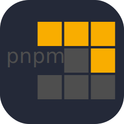

# Hello hello 

Your regular neurotypical fullstack developer. :see_no_evil:
Leaning towards frontend, actually. Sort of. I also love testing.

Did a lot of .Net; now mainly working with react/nodejs. Hail the Omnissiah! 🧙

<h1 align="center" style="color:#0c8694;text-shadow: black 0.1em 0.1em 0.2em;">What I mainly work with</h1>

<h1 align="center" style="color:#0c8694;text-shadow: black 0.1em 0.1em 0.2em;">What I did tinker with but stopped using regularly</h1>

<h1 align="center" style="color:#0c8694;text-shadow: black 0.1em 0.1em 0.2em;">GitHub Stats</h1>

  

